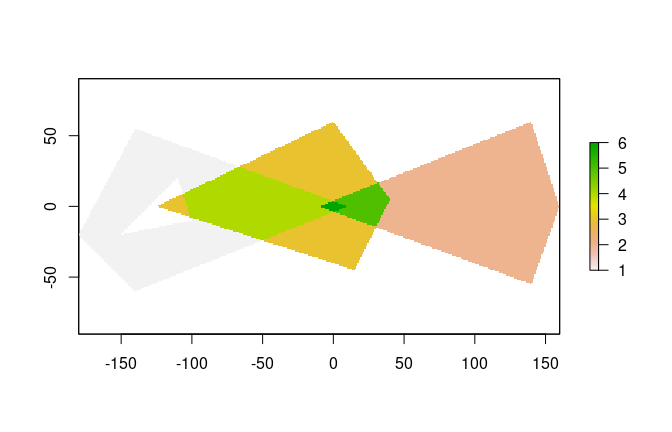
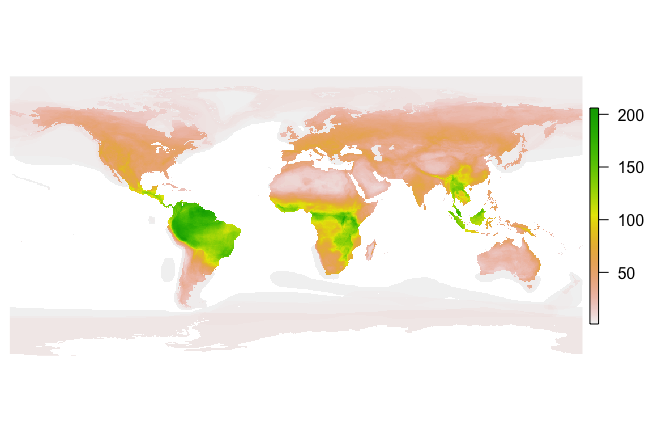

<!-- As fasterize is a small package, this vignette just copies over the major contents of the README, without badges so as to avoid CRAN errors. -->

**fasterize** is a high-performance replacement for the `rasterize()`
function in the [**raster**](https://cran.r-project.org/package=raster)
package.

Functionality is currently limited to rasterizing polygons in
[**sf**](https://cran.r-project.org/package=sf)-type data frames.

## Installation

Install the current version of **fasterize** from CRAN:

``` r
install.packages('fasterize')
```

Install the development version of **fasterize** with
[**devtools**](https://cran.r-project.org/package=devtools):

``` r
devtools::install_github("ecohealthalliance/fasterize")
```

**fasterize** uses [**Rcpp**](https://cran.r-project.org/package=Rcpp)
and thus requires a compile toolchain to install from source. Testing
(and most use) requires [**sf**](https://cran.r-project.org/package=sf),
which requires GDAL (\>= 2.0.0), GEOS (\>= 3.3.0), and PROJ.4 (\>=
4.8.0) to be installed on your system.

## Usage

The main function, `fasterize()`, takes the same inputs as
`raster::rasterize()` but currently has fewer options and is is limited
to rasterizing polygons.

A method for creating empty rasters from `sf` objects is provided, and
raster plot methods are re-exported.

``` r
library(raster)
library(fasterize)
library(sf)
p1 <- rbind(c(-180,-20), c(-140,55), c(10, 0), c(-140,-60), c(-180,-20))
hole <- rbind(c(-150,-20), c(-100,-10), c(-110,20), c(-150,-20))
p1 <- list(p1, hole)
p2 <- list(rbind(c(-10,0), c(140,60), c(160,0), c(140,-55), c(-10,0)))
p3 <- list(rbind(c(-125,0), c(0,60), c(40,5), c(15,-45), c(-125,0)))
pols <- st_sf(value = c(1,2,3),
             geometry = st_sfc(lapply(list(p1, p2, p3), st_polygon)))
r <- raster(pols, res = 1)
r <- fasterize(pols, r, field = "value", fun="sum")
plot(r)
```

<!-- -->

## Performance

Let’s compare `fasterize()` to `raster::rasterize()`:

``` r
pols_r <- as(pols, "Spatial")
bench <- microbenchmark::microbenchmark(
  rasterize = r <- raster::rasterize(pols_r, r, field = "value", fun="sum"),
  fasterize = f <- fasterize(pols, r, field = "value", fun="sum"),
  unit = "ms"
)
print(bench, digits = 3)
```

    #> Unit: milliseconds
    #>       expr     min     lq    mean  median     uq    max neval cld
    #>  rasterize 340.376 359.69 379.197 369.552 386.65 497.83   100   b
    #>  fasterize   0.337   0.37   0.545   0.414   0.64   2.51   100  a

How does `fasterize()` do on a large set of polygons? Here I download
the IUCN shapefile for the ranges of all terrestrial mammals and
generate a 1/6 degree world map of mammalian biodiversity by rasterizing
all the layers.

``` r
if(!dir.exists("Mammals_Terrestrial")) {
  download.file(
    "https://s3.amazonaws.com/hp3-shapefiles/Mammals_Terrestrial.zip",
    destfile = "Mammals_Terrestrial.zip") # <-- 383 MB
  unzip("Mammals_Terrestrial.zip", exdir = ".")
  unlink("Mammals_Terrestrial.zip")
}
```

``` r
mammal_shapes <- st_read("Mammals_Terrestrial")
```

    #> Reading layer `Mammals_Terrestrial' from data source `/Users/noamross/dropbox-eha/projects-eha/fasterize/Mammals_Terrestrial' using driver `ESRI Shapefile'
    #> Simple feature collection with 42714 features and 27 fields
    #> geometry type:  MULTIPOLYGON
    #> dimension:      XY
    #> bbox:           xmin: -180 ymin: -85.58276 xmax: 180 ymax: 89.99999
    #> epsg (SRID):    4326
    #> proj4string:    +proj=longlat +datum=WGS84 +no_defs

``` r
mammal_raster <- raster(mammal_shapes, res = 1/6)
bench2 <- microbenchmark::microbenchmark(
  mammals = mammal_raster <- fasterize(mammal_shapes, mammal_raster, fun="sum"),
  times=20, unit = "s")
print(bench2, digits=3)
```

    #> Unit: seconds
    #>     expr   min    lq  mean median    uq   max neval
    #>  mammals 0.856 0.869 0.887   0.88 0.902 0.955    20

``` r
par(mar=c(0,0.5,0,0.5))
plot(mammal_raster, axes=FALSE, box=FALSE)
```

<!-- -->


About
-----

**fasterize** is developed openly at [EcoHealth Alliance](https://github.com/ecohealthalliance) under the USAID PREDICT project..

[{ width=100% }](https://www.ecohealthalliance.org/)
[{ width=100% }](https://ohi.vetmed.ucdavis.edu/programs-projects/predict-project)
